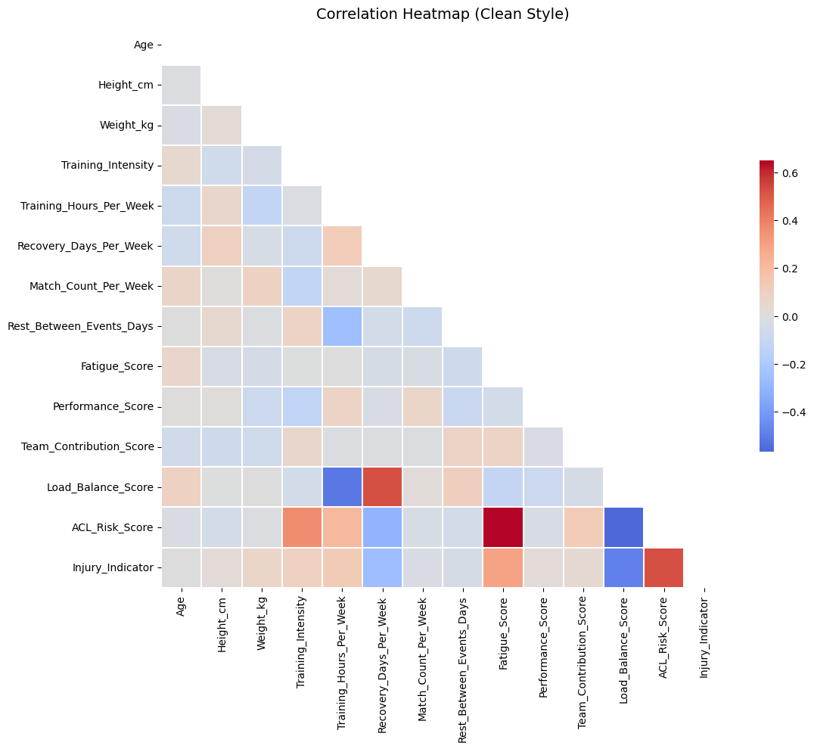

# ACL-Injury-Analysis

A personal data analysis project on athlete injuries and the likelihood of tearing the Anterior Cruciate Ligament (ACL).

## Background
As part of a **Data Analysis course**, I decided to focus on sports injuries due to a personal experience - I suffered an ACL tear, along with an MCL and meniscus injury.  
This motivated me to collect data on sports injuries, analyze it, and explore potential insights about ACL tears.

## Project Structure
- `AthletesInjuries.ipynb` - Jupyter Notebook with the full data analysis.
- Dataset: `collegiate_athlete_injury_dataset.csv` from Kaggle.
- Visualizations and statistics on different types of injuries.
- Analysis of possible risk factors for ACL tears.

## Technologies
- Python (Pandas, NumPy, Matplotlib, Seaborn)
- Jupyter Notebook

## Example Visualization
One of the key outputs is a correlation heatmap showing relationships between training load, recovery, and ACL risk indicators:



## Key Insights
- Comparison between common injury types.
- Factors associated with ACL tears.
- Data visualization for better understanding of patterns.

## Usage
1. Clone the repository:
   ```bash
   git clone https://github.com/username/ACL-Injury-Analysis.git
 
 2. Open the notebook:
   ```bash
    jupyter notebook AthletesInjuries.ipynb
